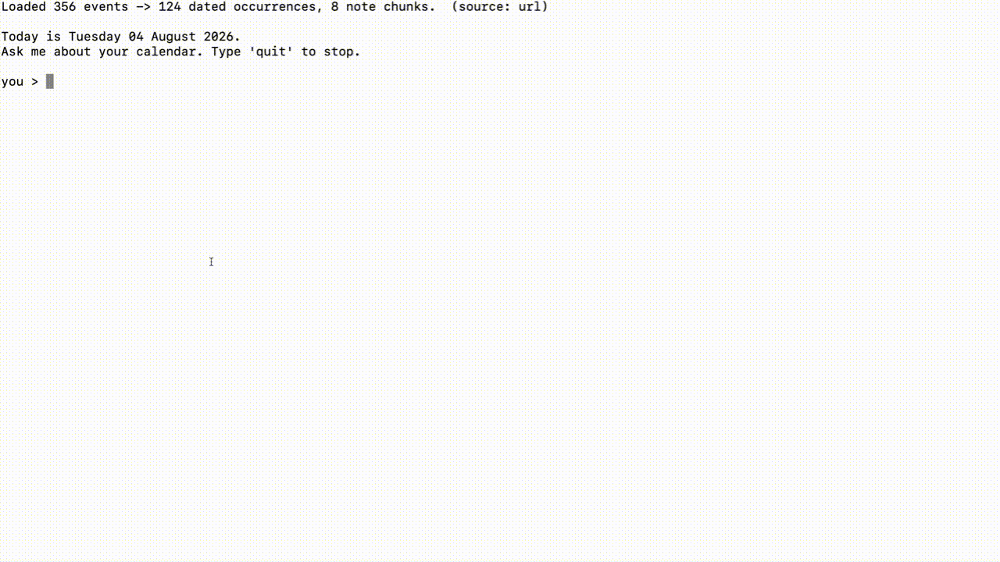

# Calendar Assistant

An assistant that answers natural-language questions about a Google Calendar and
a folder of markdown meeting notes, and can add, change, and remove events,
using the Claude API. It runs as a terminal program, as an HTTP service, or
behind a Spring Boot gateway that signs people in with Google and serves a web
interface.

## Overview

The assistant loads a calendar, expands its recurrence rules into dated
occurrences, indexes a folder of notes, and exposes both to a language model as
callable tools. The model selects a tool, receives plain text back, and composes
the reply. All date arithmetic, filtering, and ranking is performed in Python;
the model performs none of it.

Writing follows the same rule. The model never computes a date and never writes
unprompted: it names a day the way the user said it, and every tool that changes
the calendar takes two calls — one that resolves the request and describes it
without touching anything, and a second, after the user agrees, that performs
the change.

Calendars are read from any of three sources:

| Source | Flag | Requirements |
|---|---|---|
| Local `.ics` file | `--source file` (default) | `CALENDAR_FILE` |
| Google Calendar secret iCal URL | `--source url` | `GOOGLE_ICS_URL` |
| Google Calendar API | `--source api` | `credentials.json`, see **Signing in** |

All three produce identical event dictionaries. Google publishes every calendar
at a private address ending in `/basic.ics`, so the `url` source downloads
iCalendar text and hands it to the same parser a local file uses. The `api`
source signs in with OAuth and converts Google's JSON into the same shape.

**Prefer `api` for a real calendar.** It is the only source that sees a change
immediately — Google caches the iCal feed and can take hours to publish one —
and the only one that can eventually write. `login` selects it by default.

A calendar file stores recurrence rules, not individual meetings. A weekly
standup is one entry with `RRULE:FREQ=WEEKLY;BYDAY=MO,WE,FR`; the instance
falling on any given Monday exists nowhere in the file until it is computed.
Birthdays are stored as `DTSTART:19930807` with `FREQ=YEARLY`. Every rule is
therefore expanded into dated occurrences across a ±365 day window before any
query runs.

Note retrieval is a vector search: notes are split into paragraph-sized chunks,
each chunk is converted to a word-frequency vector, and chunks are ranked
against the query by cosine similarity.

Without `ANTHROPIC_API_KEY` the application runs against an offline
keyword-matching model that selects tools by regular expression and prints raw
tool output. Every code path except answer phrasing is exercised.

### Two services

The same assistant is reachable three ways, and the first two are one process:

| | What it is | Who it serves |
|---|---|---|
| `python -m assistant.main` | terminal chat | you, on your machine |
| `python -m assistant.main serve` | the same thing over HTTP | one caller, or many |
| `gateway/` | Spring Boot: Google sign-in, accounts, web interface | anybody with a browser |

The split is along a real seam. **Spring owns identity** - the OAuth flow, the
session, the user record, and refreshing tokens. **Python owns calendars** - the
recurrence rules, the date arithmetic, and the agent loop. Neither knows much
about the other's job, and the whole contract between them is two headers:

```
POST /chat
X-User-Id:      42                 this application's own id for the person
X-Google-Token: ya29....           an access token Spring has already refreshed
```

That arrangement is what makes the Python service **stateless**. It reads no
token from disk, holds no account of its own, and keeps nothing after the
request that carried it - so one process answers for any number of people, each
from their own calendar.

<!--
## Demo


-->
## Architecture

```
                      browser
                         |
                         v
gateway (Java)  Google sign-in, sessions, accounts, the chat page
                         |
                         |  X-User-Id + X-Google-Token
                         v
web.py          HTTP: /chat, /events, /free-time, /birthdays, /notes
                         |
                         v          (the terminal enters here instead)
                      agent
                         |
                         v
local .ics file    secret iCal URL    Google Calendar API
        |                 |                    |
        v                 v                    v
     ics_parser  .ics text -> event dicts   google_api  JSON -> event dicts
        |                 |                    |
        +-----------------+--------------------+
                          |
                          v
recurrence      rules      ->  dated occurrences  expands RRULE, removes EXDATEs
                          |
                          v
queries         occurrences + question -> text    filtering, date math, intervals
                          |
        +-----------------+------ agent   selects a tool, reads the result,
        |                 |                      composes the answer
data/sample_notes/*.md    |                        ^
        |                 |                        |
        v                 v                        |
search   notes -> chunks -> vectors -> ranked matches
                          |
                          v
google_api      create / update / delete  ->  Google Calendar API
                writes, then re-reads the response back into occurrences
```

The dictionary returned by `ics_parser.new_event()` is the interface between
the calendar sources and everything downstream. Remote calendar support is
roughly forty lines because acquisition is separated from parsing: the bytes
arriving over HTTP are the same iCalendar text a local file contains, and the
API source converts Google's JSON into that same dictionary rather than
introducing a second shape.

Writes run in the other direction and end by reading back. What Google returns
from a write is the event as it now exists, so that response — not the request —
is converted and spliced into the live occurrence list.

### Modules

| File | Responsibility |
|---|---|
| [`ics_parser.py`](assistant/ics_parser.py) | Parses `.ics` text into event dictionaries. Handles line folding, escaped characters, quoted parameters. |
| [`recurrence.py`](assistant/recurrence.py) | Expands `RRULE` into dated occurrences and removes `EXDATE` exclusions. |
| [`queries.py`](assistant/queries.py) | Date-phrase parsing, overlap filtering, birthday computation, free-time search. |
| [`search.py`](assistant/search.py) | Note chunking, word-frequency vectors, cosine similarity ranking. |
| [`agent.py`](assistant/agent.py) | Tool schemas, system prompt, tool-dispatch loop (max 5 steps). |
| [`memory.py`](assistant/memory.py) | Conversation history and facts persisted to disk. |
| [`google_calendar.py`](assistant/google_calendar.py) | Downloads and caches the secret iCal address. |
| [`google_api.py`](assistant/google_api.py) | OAuth sign-in, token storage and revocation, Google JSON → event dictionaries, and the create / update / delete tools. |
| [`web.py`](assistant/web.py) | The HTTP interface. Reads the caller and their token from request headers; holds no state of its own beyond a short-lived calendar cache. |
| [`llm.py`](assistant/llm.py) | Claude API wrapper with an offline fallback model. |
| [`config.py`](config.py) | Settings resolved from the environment, including the injected clock. |

### Tools exposed to the model

Reading:

| Tool | Parameters | Returns |
|---|---|---|
| `find_events` | `when`, optional `person`, `contains` | Events in a date range, optionally filtered by attendee or title |
| `find_free_time` | `when`, `duration_minutes` | Gaps in working hours long enough for the requested duration |
| `upcoming_birthdays` | `within_days` | Birthdays in the window, sorted by proximity |
| `search_notes` | `query` | Highest-ranked note chunks with their source filenames |
| `remember_fact` | `fact` | Confirmation; the fact is appended to every later system prompt |
| `directions` | `when`, optional `summary`, `origin`, `mode` | Google Maps links for events worth travelling to, and why the others were skipped |

Writing — each requires `--source api` and a signed-in account:

| Tool | Parameters | Returns |
|---|---|---|
| `create_event` | `summary`, `when`, optional `start_time`, `duration_minutes`, `location`, `description`, `confirm` | The event it would create, or the created event |
| `update_event` | `summary`, `when`, optional `new_when`, `new_start_time`, `new_duration_minutes`, `new_summary`, `new_location`, `scope`, `confirm` | The event before and after, or the applied change |
| `delete_event` | `summary`, `when`, optional `scope`, `confirm` | The event it would remove, or confirmation that it is gone |

The writing tools share one contract, defined once in `agent.TWO_PHASE` and
interpolated into all three descriptions. The first call resolves the request
and changes nothing; the second, carrying `confirm`, performs it. Three
hand-written copies of that instruction drifted in practice — only
`delete_event` picked up an extra confirmation from the model — which is why it
now has a single definition.

They are also offered only when the session can reach the calendar it would
write to. `agent.tools_for` hands out the reading tools alone unless the source
is `api`, so a session showing a local file cannot quietly change a real
calendar. A tool the model never sees is one it cannot misuse, and one it never
has to explain refusing.

### Changing a repeating event

A recurrence rule is a formula, not a list of events, so a single occurrence
cannot be edited in place. `scope` says what a change means, and is never
guessed — the tools refuse an `RRULE` target until told which:

| `scope` | What happens |
|---|---|
| `this` | Google records an override for that occurrence. The rule is untouched |
| `following` | The rule really does split: the original is capped with `UNTIL`, and a second rule carries on from the boundary |
| `series` | The rule itself is changed |

Only `following` divides anything. `_rrule_capped_before` handles the awkward
part — a rule bounded by `COUNT` cannot be copied into both halves, so the
first is bounded by `UNTIL` instead and the second gets however many
occurrences remain. The cap is written before the replacement is created: a
failure between the two leaves a short series and a visible gap, where the
other order would duplicate every remaining occurrence from two rules at once.

Reading them back is where the split *appears* even for `this`.
`_apply_overrides` turns each override into the two things `recurrence.py`
already understands — the original time joins the rule's exclusions, and the
replacement becomes an ordinary one-off event. A cancelled occurrence is an
exclusion with nothing replacing it. `recurrence.py` needed no changes at all.

Tool errors are returned to the model as text rather than raised. An
unrecognised date phrase produces the list of supported phrases, which the model
reads before retrying. The same channel carries refusals: an ambiguous target,
a multi-day range where a single day is needed, or a repeating event.

When a question asks for a number of events and the range searched holds fewer,
the model widens it — 30 days, then 90, then a year — rather than asking
permission to look further.

### Conversation

The assistant is meant to be talked to rather than queried. Three behaviours
are asked for in the system prompt rather than built in code:

- **It follows the thread.** "who else is in that one", "when am I free that
  day", "move it instead" resolve against what was just discussed. Something
  the user has already settled is not asked again.
- **It offers the obvious next step**, as one short question and never a menu —
  directions after an event worth travelling to, the next free slot after a
  full day. When there is no obvious next step it stops, because a trailing
  question on every answer is worse than none.
- **It remembers standing preferences.** A usual office, a preferred time of
  day, a name someone uses for something: saved with `remember_fact` and
  appended to every later system prompt. The test is whether it would still be
  true next week.

Asking is reserved for choices where the answers differ materially — which of
two events, one occurrence against a whole series. Everywhere else it decides
and says what it decided, rather than handing the decision back.

### Directions

`directions` hands back a [Maps URL](https://developers.google.com/maps/documentation/urls/get-started):
a documented, keyless scheme needing no API key, billing account, or quota.
Answering *how long* a journey takes would need the Routes API and a payment
method; handing over a link needs neither and covers most of what is actually
wanted.

The work is not the link, it is deciding what deserves one. `location_kind`
reads the free-text location field and returns one of four answers:

| Kind | Example | Result |
|---|---|---|
| `place` | `Javits Center`, `Newark EWR`, a full address | a link |
| `virtual` | `Zoom`, `meet.google.com/...` | no link — it is online |
| `internal` | `Room 2A`, `Conference Room B` | no link — a room, not a destination |
| `none` | empty | no link — nothing to route to |

It errs towards `place`, because Maps resolves a venue name or an airport code
as readily as a postal address. The bar is not "is this a valid address" but
"would offering directions here be absurd", and only two things are.

Skipped events are named when there are few and counted when there are many —
a single usable link buried under thirty lines of "no location set" reads worse
than no answer. `summary` matches the location as well as the title, since
people name the destination as often as the event.

### Supported date phrases

`parse_when` accepts only the following. Anything else raises and returns the
list to the model.

| Phrase | Range |
|---|---|
| `today`, `tomorrow`, `yesterday` | One day, midnight to midnight |
| `this week`, `next week`, `last week` | Calendar week, Monday to Sunday |
| `this month`, `next month`, `last month` | Calendar month |
| `next N days` | Today through N days ahead |
| `last N days` | N days back through end of today |
| `YYYY-MM-DD` | That single day |
| `monday` … `sunday` | The next such weekday, never today |
| `next monday` … `next sunday` | The weekday in the following week |

All ranges are half-open, `[start, end)`.

## Installation

```bash
python3 -m venv .venv
source .venv/bin/activate
pip install -r requirements.txt
```

Developed against Python 3.12. Dependencies are `python-dateutil`, `anthropic`,
and `python-dotenv`, plus `google-auth-oauthlib` and `google-api-python-client`
for the authorized API path, and `flask` for the HTTP service.

The gateway needs a JDK 21 or later and nothing else - it carries a Maven
wrapper, so `./gateway/run.sh` fetches its own build tool and dependencies the
first time it runs.

### Configuration

Settings are read from the environment. `config.py` loads a git-ignored `.env`
file; real environment variables take precedence over it.

```bash
cp .env.example .env
```

| Variable | Default | Purpose |
|---|---|---|
| `ANTHROPIC_API_KEY` | unset | Enables the real model. Without it, the offline fallback is used. |
| `ANTHROPIC_MODEL` | `claude-sonnet-5` | Model identifier |
| `ANTHROPIC_EFFORT` | `low` | How hard the model thinks. The main cost lever — thinking bills as output tokens. Raise to `medium` or `high` if answers miss the point. |
| `GOOGLE_ICS_URL` | unset | Secret iCal address, required for `--source url` |
| `CALENDAR_FILE` | `data/sample_calendar.ics` | Local calendar for `--source file` |
| `CALENDAR_NOW` | pinned to 2026-08-03 09:00 | Set to `now` to use the system clock |
| `CALENDAR_TIMEZONE` | `America/New_York` | The single zone the assistant assumes. A zone name, never an offset — `EST` would be wrong from March to November. |
| `NOTES_FOLDER` | `data/sample_notes` | Directory of `.md` files to index |
| `FACTS_FILE` | `data/facts.json` | Where `remember_fact` persists what it is told |
| `CACHED_ICS_FILE` | `data/google_cache.ics` | Where the `cache` command writes its copy |
| `HOME_ADDRESS` | unset | Where directions start from. The calendar knows where an event is, never where you are; without this a link starts from wherever the device is. |
| `WORK_START_HOUR` | `9` | Lower bound for free-time search |
| `WORK_END_HOUR` | `17` | Upper bound for free-time search |
| `CREDENTIALS_FILE` | `credentials.json` | OAuth client downloaded from the Google Cloud console |
| `TOKEN_FILE` | `token.json` | Where the token is written after signing in |
| `REVOKE_ON_EXIT` | `1` | Revoke and delete the token when a signed-in session ends. Set to `0` to stay signed in between runs. |
| `AUTH_TIMEOUT_SECONDS` | `120` | How long to wait for the browser during sign-in before giving up |

`CALENDAR_NOW` defaults to a fixed date because the bundled sample calendar is
built around 3 August 2026. Set it to `now` when using a real calendar.

`CALENDAR_TIMEZONE` is the one place a zone is named. Everything internal is
naive wall-clock time; this setting is what the edges convert against.

The secret iCal address is obtained from Google Calendar under Settings → the
calendar → Integrate calendar → **Secret address in iCal format**.

> **The iCal URL is a credential.** It grants permanent read access to the
> entire calendar without authentication and does not expire until reset. It
> belongs in `.env`, which is git-ignored.

### Signing in

Reading a calendar over `--source api`, and every tool that writes, needs an
OAuth client. **Two of them, if you run the gateway**, because Google treats
the two flows as different kinds of application:

| Client type | Used by | Redirect |
|---|---|---|
| **Desktop app** | the terminal (`login`) | a throwaway local server on a random port |
| **Web application** | the gateway | `http://localhost:8080/login/oauth2/code/google` |

Both live on the same project and share one consent screen, so scopes and test
users are configured once. The steps below create the desktop one; for the
gateway, choose **Web application** instead and register that redirect URI
exactly - Google compares it as a string, and `localhost` and `127.0.0.1` are
not the same.

In the [Google Cloud console](https://console.cloud.google.com):

1. Create or select a project, and stay in it for every step below.
2. Enable the **Google Calendar API**. Do this first — the scope in step 4 does
   not appear in the picker until the API it belongs to is enabled.
3. **Google Auth Platform** → *Get Started*. Audience **External** (Internal
   exists only for Workspace organisations). Add your own address as a **test
   user**.
4. **Data Access** → *Add or remove scopes* → `.../auth/calendar.events`.
5. **Credentials** → *Create credentials* → **OAuth client ID** → type
   **Desktop app** → download the JSON as `credentials.json` in the project
   root.

A correct file begins with `{"installed":`. One beginning `{"web":` is a Web
application client and will not work: the sign-in runs a throwaway local server
and catches the redirect on `localhost`, which is what a Desktop client permits.

```bash
python -m assistant.main login
```

The browser opens once. The **"Google hasn't verified this app"** warning is
expected while the consent screen is in Testing — choose *Advanced*, then
continue. Choosing *Back to safety* leaves without answering, which the sign-in
detects by timeout rather than waiting forever.

`login` prints which account it signed in as, warns if that calendar's timezone
differs from `CALENDAR_TIMEZONE`, lists a few events as proof the token works,
and then opens the chat session against `--source api`.

> **`token.json` is a credential, not a cache.** Anything holding it can read
> and edit the calendar it was granted. It is git-ignored, and by default it is
> revoked with Google and deleted when the session ends — so every run asks for
> consent again. Set `REVOKE_ON_EXIT=0` to keep it between runs.

While the consent screen is in Testing, Google expires refresh tokens after
seven days. With the default `REVOKE_ON_EXIT=1` this is invisible, since no
token outlives its session.

### macOS certificate configuration

Python distributions from python.org install no root certificates, causing
`CERTIFICATE_VERIFY_FAILED` on the calendar download. Install them once:

```bash
"/Applications/Python 3.12/Install Certificates.command"
```

## Usage

```bash
python -m assistant.main [command] [--source file|url|api]
```

| Command | Behaviour | Model required |
|---|---|---|
| *(none)* | Interactive chat | Yes |
| `agenda "<phrase>"` | Prints events in a date range | No |
| `birthdays` | Prints upcoming birthdays | No |
| `cache` | Downloads `GOOGLE_ICS_URL` to `data/google_cache.ics` | No |
| `login` | Signs in with Google, reports the account, then opens the chat against `--source api` | Yes |

Verify the calendar loads before starting a chat session:

```bash
python -m assistant.main agenda "this week" --source url
```

Start the assistant:

```bash
python -m assistant.main --source url
```

```
Q> what's on my calendar tomorrow?
   (used find_events with {'when': 'tomorrow'})

A> You have two things tomorrow: ...

Q> quit
```

Questions are prompted with `Q>` and answers prefixed with `A>`. Each turn
prints the selected tool and its arguments before the answer.

Changing the calendar takes two turns, and the first one writes nothing:

```
Q> add lunch with Priya tomorrow at 12:00
   (used create_event with {'summary': 'Lunch with Priya', 'when': 'tomorrow', 'start_time': '12:00'})

A> I'd add:
     Wed 12 Aug  12:00-13:00  Lunch with Priya
   Shall I go ahead?

Q> yes
   (used create_event with {..., 'confirm': True})

A> Done.
```

What you approve is rendered by the same formatter that prints every other
event, so the line you agree to is the line you will read back later.

To avoid re-downloading the calendar on every start, cache it and read the
cached file:

```bash
python -m assistant.main cache
CALENDAR_FILE=data/google_cache.ics python -m assistant.main
```

## The HTTP service

```bash
python -m assistant.main serve [--source file|url|api]
```

Every endpoint hands off to the functions the terminal already uses, so a wrong
answer is wrong in `queries` or `agent` rather than here.

| Endpoint | |
|---|---|
| `GET /health` | what loaded, and whether this process can write |
| `GET /events?when=&person=&contains=` | |
| `GET /free-time?when=&duration_minutes=` | |
| `GET /birthdays?within_days=` | |
| `GET /notes?query=` | |
| `GET /history` | what this caller has said, and what was answered |
| `POST /chat` | `{"message": ...}` → the answer, plus which tools ran |

`POST /chat` returns `tools_used` alongside the answer - the same trace the
terminal prints. A caller has no other way to see which tool ran, and when one
of them changed a calendar that is the interesting part.

### What a failure means

Three outcomes, kept apart because only one of them is worth retrying:

| | Meaning |
|---|---|
| **400** | The request was wrong. An unusable date phrase comes back with the list of phrases that work. |
| **401** | No `X-Gateway-Key`, or the wrong one. |
| **502** | Google or the model failed us. The request was fine. |
| **500** | A defect here. The message is not echoed back, since it is written for us and may name internals. |

### Who is asking

`X-User-Id` names the caller; `X-Google-Token` carries their access token.
Conversations, saved facts, and calendars are all kept per person, and the
token is used for that request and then forgotten.

Both headers are optional. Without them the service answers as a single
anonymous user from whatever `--source` was given, which is what the terminal
does. With `--source api` a token is required, because there is no calendar to
read without one - and saying so is better than answering from an empty one,
which reads as "you have nothing scheduled".

> **The header is not proof of identity.** This service never sees a password
> or a consent screen, so it cannot check who anyone is. What it can check is
> that the request came from the one service allowed to ask.

Set `GATEWAY_SECRET` and every request must carry it in `X-Gateway-Key`, or be
refused with a 401. `/health` is exempt, so a monitor can ask whether the
process is alive without holding a credential. The gateway reads the same
`.env`, so the two halves cannot drift apart - and a value set on only one side
fails loudly rather than quietly leaving the service open.

Without the secret set, `X-User-Id` is a claim anyone able to reach the port can
make. That is fine on one machine and nowhere else.

## The gateway

A Spring Boot application that signs people in with Google, keeps an account
for each of them, and serves the web interface. It is the only part exposed to
a browser.

```bash
./gateway/run.sh          # reads the OAuth client from OAuthCrediential.json
```

Then <http://localhost:8080/>. Use `localhost` rather than `127.0.0.1` unless
both are registered as redirect URIs - Google compares them as strings.

| | |
|---|---|
| `GET /` | the chat page |
| `GET /me` | the signed-in account |
| `GET /token-status` | whether a refresh token is held, and when the access token expires |
| `GET /health`, `/calendar-health` | this service, and the one behind it |
| `GET /history` | the conversation so far, so a reload does not start blank |
| `POST /chat` | proxied downstream with the caller's id and token |
| `POST /logout` | |

**Accounts are keyed on the Google subject**, never the email address.
Addresses change and get reused, and keying on one would let a new owner of an
old address inherit the previous owner's history. The email is stored for
display only.

**Signing in is registration.** The first arrival writes a row; every later one
finds it again by subject and refreshes the display fields. There is no
separate sign-up, and changing your Google address does not create a second
account.

**Accounts, tokens, and sessions outlive the process.** They are in a database
file rather than in memory, so restarting the server no longer signs everyone
out and hands the next arrival user 1. Tokens are kept by Spring's
`JdbcOAuth2AuthorizedClientService`, which means the refresh token survives too
and an expired access token is renewed without anyone being asked again.

**`prompt=consent` is still on.** Google issues a refresh token only on the
consent that first grants access, so without it a returning user could arrive
with an access token and no way to renew it - a failure that appears an hour
later rather than at sign-in. Now that tokens persist this is closer to
optional; see `DECISIONS.md`.

**CSRF protection is on.** Sessions are carried by a cookie, which is precisely
what lets another site post to this one on a signed-in user's behalf. The token
is served from `GET /csrf`, which also causes the cookie to be written, since
it is created lazily.

**The conversation is not in the page.** It is kept by the calendar service and
fetched on load, so a reload shows what was actually said rather than an empty
window in front of an assistant that remembers all of it.

### The web interface

One page, no framework. Message bubbles, a thinking indicator, and the tool
trace under each answer.

Answers are markdown, so they are rendered - bold titles, lists, and clickable
Maps links. Every node is built and filled with `textContent`; nothing is ever
assigned to `innerHTML`. That is not stylistic caution. The text passing through
contains event titles, which come from a calendar that may hold events other
people created, and `` is a legal calendar entry.

Confirmations become **Go ahead** and **Cancel** buttons. Whether to offer them
is not decided by reading the answer for a question mark - the wording varies -
but from the tool trace: a writing tool that ran without `confirm` means the
tool described what it would do and changed nothing. The buttons send the same
words you would have typed, so typing still works.

## Running the whole thing

Three terminals, or two if you skip the browser.

```bash
# 1. the calendar service, reading whichever calendar the caller signs in to
python -m assistant.main serve --source api

# 2. the gateway
./gateway/run.sh

# 3. a browser
open http://localhost:8080/
```

Set `GATEWAY_SECRET` in `.env` first. Both halves read it from there, and
without it the calendar service answers anyone who can reach port 5000:

```bash
python3 -c "import secrets; print('GATEWAY_SECRET=' + secrets.token_urlsafe(32))" >> .env
```

On macOS, port 5000 is also AirPlay Receiver. It is bound to `::1` while Flask
binds `127.0.0.1`, so `localhost:5000` can reach AirPlay and return a puzzling
403. Use `127.0.0.1:5000`, or turn AirPlay Receiver off in System Settings.


With `--source api` the calendar service needs no Google account of its own:
every request brings the token it should use. Started any other way it reads
one calendar and serves it to everyone, which is right for a single user and
wrong for several.

## Design decisions

**Calendar acquisition is separated from parsing.**
`google_calendar.py` downloads bytes; `ics_parser.py` interprets them. Rationale:
a remote calendar is the same iCalendar text as a local file, so no module below
the parser needs to know where the text came from. Trade-off: sources that do
not emit iCalendar would need a converter to the event dictionary rather than
plugging straight in.

**The model performs no date arithmetic.**
Date phrases are passed through verbatim and resolved by `parse_when`. Rationale:
language models produce incorrect dates with high confidence, making the failure
silent. Trade-off: only enumerated phrases are supported; anything else returns
an error string.

**Note vectors are word frequencies, not embeddings.**
`text_to_vector` counts tokens after stop-word removal. Rationale: the
similarity computation remains inspectable, and no additional API dependency is
introduced. Trade-off: matching is lexical, so a query for "pricing" does not
retrieve a note that consistently says "cost".

**Datetimes are naive throughout, and converted only at the edges.**
Every layer works in wall-clock time and assumes a single zone, set by
`CALENDAR_TIMEZONE`. Rationale: keeps interval and overlap logic readable.
Conversion happens exactly where a source states an offset and nowhere else —
`parse_datetime` on a `Z`-marked timestamp, and the API converter on the
offsets Google sends. Trade-off: a `TZID` naming a different zone is taken at
face value, and `RRULE` `UNTIL` values written in UTC are still read as local,
which can carry a series a few hours past its intended end.

**Every write is confirmed, in two calls rather than a prompt.**
A writing tool called without `confirm` resolves the request and describes it
without touching the calendar; a second call performs it. Rationale: a tool
returns a string to the model and does not own the terminal, so blocking on
input would break both the "modules return, main prints" convention and any
future HTTP transport. Confirming from the *resolved* event also beats
confirming from the request, which is what the model would otherwise paraphrase.
Trade-off: two round trips for every change.

**Changes are patched, never re-created.**
`update_event` sends only the fields that differ. Rationale: deleting and
re-creating mints a new event id, emails a cancellation followed by a fresh
invitation so every RSVP is lost, drops the meeting link and every other field
this project does not model, and is not atomic — a dropped connection midway
destroys the event rather than leaving it unchanged. Trade-off: none worth
naming; the patch body is also less code than a rebuild.

**A write is read back from its own response.**
Google returns the event as it now exists, and that response, not the request,
is converted and spliced into the live occurrence list. Rationale: an assistant
that cannot see what it just did is worse than one that cannot write, and the
stored event may differ from the one requested. Trade-off: the occurrence list
is mutated in place, so the tool depends on receiving the session's actual list.

**Ambiguity is refused, not guessed.**
`update_event` and `delete_event` resolve a target from a title and a day
through one shared function, and stop when that names anything other than
exactly one event. Rationale: guessing wrong destroys something, and a request
matching three events carries no information about which. Trade-off: naming an
event twice is occasionally tedious.

**Ranges are half-open and matched by overlap.**
Every window is `[start, end)`, and an occurrence qualifies if it overlaps the
window rather than being contained by it. Rationale: inclusive bounds place a
midnight event in two weeks simultaneously, and containment excludes a
13:00–14:30 meeting from a 14:00–14:15 query.

**Tool errors are returned as text, not raised.**
`run_tool` catches exceptions and returns the message. Rationale: a raised
exception terminates the conversation, whereas a returned string is read by the
model, which corrects its call on the next step. Trade-off: genuine defects
surface as messages rather than stack traces.

**The clock is injected.**
`config.NOW` is resolved once at import; `datetime.now()` is never called
inline. Rationale: every date-dependent function can be exercised against a
fixed date rather than whatever today happens to be. Trade-off: `CALENDAR_NOW`
must be set explicitly for real use, and forgetting it silently returns results
for 3 August 2026.

## Limitations

**The shared secret is symmetric.** Both services hold the same string, so it
proves the caller is the gateway and nothing more - it does not prove which
user, and anyone who reads it can use it. A signed token the calendar service
verified without holding the signing key would be better. This is the level of
protection the deployment needs, not the most that is possible.

**The database is H2.** It is a file now rather than memory, so accounts,
tokens, and sessions survive a restart, but H2 is a development database. A
real deployment wants Postgres, which is a connection string and a dependency
rather than a code change.

**Both servers are development servers.** Flask says so on startup, and
`spring-boot:run` is a development goal. Neither is meant to face the internet.

**Only the API source understands a changed occurrence.** `--source api` folds
Google's override records back into the series it belongs to; the `.ics` parser
still skips the equivalent `RECURRENCE-ID` components. So a moved occurrence
appears at its new time under `--source api` and at its original time under
`--source url`. The two sources agree on everything else.

**Google's Birthdays calendar is unavailable.** It is generated from Contacts
rather than stored in a calendar, and appears in no calendar export. Birthdays
are retrieved only where they exist as ordinary recurring events.

**`RECURRENCE-ID` overrides are ignored.** An individually rescheduled or
cancelled instance of a recurring event is recorded as a separate component,
which the parser skips. The instance appears at its original time.

**Lexical note matching.** See the word-frequency decision above. Replacing
`text_to_vector` with an embeddings call is the intended next change.

**The iCal feed lags.** Google caches the secret address and can take hours to
publish a change, so `--source url` may not show an event that already exists —
including one this assistant just created. `--source api` reads through the
Calendar API and reflects a change immediately.

**A `TZID` naming another zone is read as local.** Times are converted only
where the source states an offset: a `Z` in the feed, or the offset the API
sends. An event written `TZID=Europe/London` is taken at face value rather than
converted, so it displays at London's wall-clock time. `CALENDAR_TIMEZONE`
assumes one zone, and this is the edge of that assumption.

**Offline fallback is not a model.** Without `ANTHROPIC_API_KEY`, tool selection
is regular-expression matching and the response is raw tool output.

## Future features

Ordered roughly by how much new machinery each one drags in.

- **Keep accounts and tokens between restarts.** Spring can persist authorised
  clients, including refresh tokens, rather than holding them in memory; the
  user table needs a real database rather than H2. Until then the gateway is
  usable only for as long as it stays running.

- **The conversation survives a reload.** The calendar service remembers what
  was said; the page does not, so refreshing empties the window while the
  assistant carries on as though nothing happened.

- **Teach the `.ics` parser about `RECURRENCE-ID`.** The API source folds
  changed occurrences back into their series; the file and feed sources do not,
  so the same calendar read two ways disagrees about a moved occurrence. The
  logic already exists in `_apply_overrides` — it needs an equivalent in the
  parser, working from `RECURRENCE-ID` components rather than Google's JSON.

- **Travel times, not just links.** `directions` returns a Maps link; it cannot
  say how long a journey takes or when to set off. That needs the Routes API, a
  billing account, and a spend cap — and it is what would let `find_free_time`
  know that a gap is not free if you are crossing town in it.

- **RESTful service.** Expose the agent over HTTP (post a message, get an
  answer), a browser front-end with message bubbles, and per-user sessions:
  separate calendar, notes, conversation history, and facts for each account.
  The largest change of the four — `memory.py` currently persists a single
  global conversation, so state would have to become per-user, and accounts
  bring authentication with them.

---

The sample calendar in `data/` and the notes in `data/sample_notes/` are
fictional.
